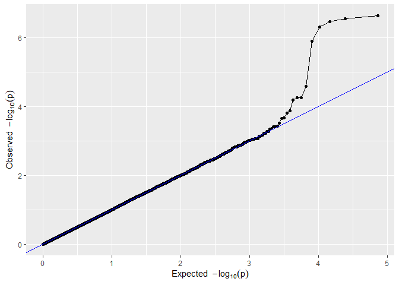
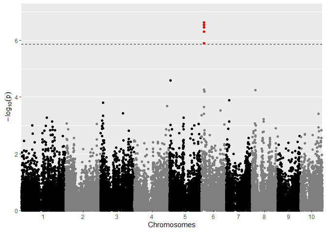
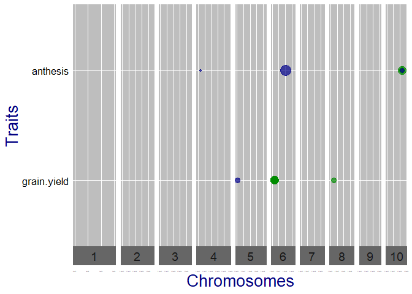

<!-- README.md is generated from README.Rmd. Please edit that file -->

# statgenGWAS

[](https://www.r-pkg.org/pkg/statgenGWAS)
[](https://www.r-pkg.org/pkg/statgenGWAS)
[](https://github.com/Biometris/statgenGWAS/actions?workflow=R-CMD-check)
[](https://codecov.io/gh/Biometris/statgenGWAS)

**statgenGWAS** is an R package for fast single trait Genome Wide
Association Studies (GWAS)

statgenGWAS has extensive options for summarizing and visualizing
results. The example below shows a selection of what is possible. For a
full overview of all options it is best to read the
[**vignette**](https://biometris.github.io/statgenGWAS/articles/GWAS.html)

## Installation

  - Install from CRAN:

<!-- end list -->

``` r
install.packages("statgenGWAS")
```

  - Install latest development version from GitHub (requires
    [remotes](https://github.com/r-lib/remotes) package):

<!-- end list -->

``` r
remotes::install_github("Biometris/statgenGWAS", ref = "develop", dependencies = TRUE)
```

## Examples

Example using the data from the EPPN2020 project. The same data is used
in the vignette and described there in detail.

First get the data in the form required by the package, converting it to
an object of class **g**(enomic)**Data**.

``` r
library(statgenGWAS)
## Read data.
data("dropsMarkers")
data("dropsMap")
data("dropsPheno")

## Add genotypes as row names of dropsMarkers and drop Ind column.
rownames(dropsMarkers) <- dropsMarkers[["Ind"]]
dropsMarkers <- dropsMarkers[colnames(dropsMarkers) != "Ind"]

## Add genotypes as row names of dropsMap.
rownames(dropsMap) <- dropsMap[["SNP.names"]]
## Rename Chomosome and Position columns.
colnames(dropsMap)[match(c("Chromosome", "Position"), colnames(dropsMap))] <- c("chr", "pos")

## Convert phenotypic data to a list.
dropsPhenoList <- split(x = dropsPheno, f = dropsPheno[["Experiment"]])
## Rename Variety_ID to genotype and select relevant columns.
dropsPhenoList <- lapply(X = dropsPhenoList, FUN = function(trial) {
  colnames(trial)[colnames(trial) == "Variety_ID"] <- "genotype"
  trial <- trial[c("genotype", "grain.yield", "grain.number", "seed.size",
                   "anthesis", "silking", "plant.height", "tassel.height",
                   "ear.height")]
  return(trial)
})

## Create a gData object all data.
gDataDrops <- createGData(geno = dropsMarkers, map = dropsMap, pheno = dropsPhenoList)
```

``` r
## Remove duplicate SNPs from gDataDrops.
gDataDropsDedup <- codeMarkers(gDataDrops, impute = FALSE, verbose = TRUE) 
#> Input contains 41722 SNPs for 246 genotypes.
#> 0 genotypes removed because proportion of missing values larger than or equal to 1.
#> 0 SNPs removed because proportion of missing values larger than or equal to 1.
#> 5098 duplicate SNPs removed.
#> Output contains 36624 SNPs for 246 genotypes.
```

``` r
## Run single trait GWAS for traits 'grain.yield' and 'anthesis' for trial Mur13W.
GWASDrops <- runSingleTraitGwas(gData = gDataDropsDedup,
                                trials = "Mur13W",
                                traits = c("grain.yield", "anthesis"))
```

``` r
## QQ plot of GWAS Drops.
plot(GWASDrops, plotType = "qq", trait = "grain.yield")
```



``` r
## Manhattan plot of GWAS Drops.
plot(GWASDrops, plotType = "manhattan", trait = "grain.yield")
```



``` r
## Qtl plot of GWAS Drops.
## Set significance threshold to 4 and normalize effect estimates.
plot(GWASDrops, plotType = "qtl", yThr = 4, normalize = TRUE)
```


